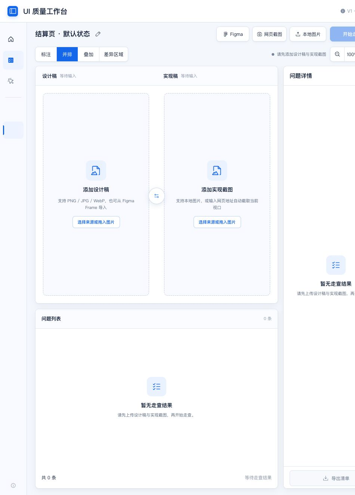

# UI 质量工作台

一个以 Codex Skill 形式运行的本地 UI 一致性走查工具。它把设计稿与实现截图归一化后进行像素和轮廓分析，生成待人工复核的差异候选，并支持整理、确认和导出审阅清单。

> 当前版本只实现了 **UI 一致性走查**。交互体验审查、无障碍审查、DOM/计算样式检查、多人协作等能力仍在规划中；界面中出现的相关入口不代表功能已经可用。



## 已实现能力

- 从本地选择或拖拽导入 PNG、JPEG、WebP 设计稿和实现截图；两个输入区域各自只接受一张图片。
- 通过包含 `node-id` 的 Figma `design` / `file` 链接和个人访问令牌（PAT），导入指定 Frame/Node 的 PNG 渲染图。
- 使用临时、隔离的 Chrome/Chromium/Edge 配置，为 HTTP(S) 页面截取指定尺寸的当前视口。
- 对比前以较宽图片的宽度为目标：较宽图片保持 1×，只将较窄图片等比例放大到相同宽度；支持顶部、底部和元素对齐，不会非等比拉伸或静默裁剪。
- 元素对齐支持在两张图中粗略圈选同一个按钮、文字或菜单，自动吸附视觉边界后按识别锚点平移，并只分析两图重叠区域。
- 并排模式使用一个共享滚动画布，设计稿和实现稿会同步上下、左右滚动；两侧输入均可独立替换或移除。
- 在生成局部问题前执行输入可比性检查：低可比性输入停止分析，中等可比性输入保留人工复核警告。
- 在浏览器 Worker 中运行启发式像素差异、边缘分析和空间分组，生成差异候选。
- 在对比视图、问题列表和详情面板中人工确认、驳回或忽略候选，并分别设置严重度、优先级和备注。
- 默认导出已确认的问题，支持 Markdown、JSON 和带标注验收板 PNG。

## 工作方式

1. 导入一张设计稿和一张实现截图，尽量保证路由、状态、内容、语言、视口和滚动位置一致。
2. 检查宽度归一化预览并选择合适的对齐方式。没有可靠的顶部或底部参照时，可粗略圈选两张图中的同一个稳定元素进行对齐。
3. 点击“开始走查”。输入可比性过低时不会生成容易误导的问题列表。
4. 把分析结果视为候选，而不是已确认缺陷，逐条排除字体加载、抗锯齿、动态内容、动画时机和过期设计稿等干扰。
5. 完成人工确认、严重度与优先级判断后导出清单。

## 在 Codex 中安装

Codex 官方支持使用 `$skill-installer` 从其他仓库安装 Skill。由于本项目当前使用私有仓库，执行安装的 Codex 环境还必须具备该仓库的读取权限。

在 Codex 对话中调用 `$skill-installer`，并给出类似下面的请求（将占位符替换为实际仓库地址）：

```text
请从 https://github.com/BrainLiuYH/ui-quality-workbench/tree/main/workbench/skill-package
安装 ui-quality-workbench skill。
```

安装后可以这样调用：

```text
$ui-quality-workbench 打开 UI 质量工作台
```

Codex 会启动仅监听 `127.0.0.1` 的本地服务，并返回带有本次启动令牌的动态地址。若安装或更新后未看到 Skill，可重启 Codex。关于 Skill 的目录格式、发现位置和安装方式，可参考 [OpenAI 官方 Build skills 文档](https://learn.chatgpt.com/docs/build-skills)。

## 从仓库直接运行

已打包的 Skill 不需要安装前端依赖。需要 Python 3 和支持现代浏览器 API 的浏览器：

```bash
python3 workbench/skill-package/scripts/serve_workbench.py --check
python3 workbench/skill-package/scripts/serve_workbench.py
```

启动器会输出一行包含 `event: "ready"`、动态回环地址和进程信息的 JSON。请使用它返回的完整地址。

可选能力还有额外要求：Figma 导入需要有效 PAT 和访问 Figma 的网络；网页截图需要本机安装受支持的 Chrome、Chromium 或 Edge。

## 本地开发

前端源码位于 `workbench/`，使用 React 和 Vite。使用仓库内的 pnpm 锁文件安装依赖：

```bash
cd workbench
pnpm install --frozen-lockfile
pnpm run dev
```

常用校验命令：

```bash
pnpm run build
pnpm run test
```

`pnpm run build` 会生成浏览器静态文件和 Sites Worker 交付物，并把最新浏览器构建同步到 `workbench/skill-package/assets/workbench/`。不要假设开发服务器的代码会自动进入已打包 Skill。

## 目录结构

```text
.
├── README.md
├── docs/                         # 产品、数据模型与规划文档
│   └── assets/                   # README 预览资源
└── workbench/
    ├── src/                      # React 工作台与对比引擎源码
    ├── tests/                    # Node 与 Python 测试
    ├── scripts/                  # 构建与本地启动脚本
    ├── worker/                   # Sites Worker
    └── skill-package/            # 可由 Codex 安装的独立 Skill
        ├── SKILL.md
        ├── scripts/
        ├── references/
        └── assets/workbench/     # 已构建的工作台
```

## 隐私与安全边界

- 本地图片的解码、归一化和差异分析留在当前浏览器会话中；项目本身不提供云端账户、存储或远程任务服务。
- 本地桥接服务只监听回环地址，并对来源和写入请求使用每次启动生成的令牌。这些措施降低暴露面，但不构成正式安全审计或端到端隐私保证。
- Figma 导入会把 PAT 发送给 Figma API，并下载指定节点的 PNG。界面中临时输入的 PAT 不由启动器持久化；通过 `FIGMA_ACCESS_TOKEN` 提供的令牌会在启动器进程生命周期内存在。
- 网页截图会让隔离浏览器请求目标 URL。它不会继承日常浏览器的 Cookie、登录状态、扩展、打开的标签页或本地存储。
- 不要把 PAT、启动令牌、Cookie 或其他凭据写入截图、日志、导出清单或仓库。

## 重要限制

- 分析器没有 OCR、产品语义或设计意图，只能依据栅格像素与轮廓做启发式判断；所有输出都必须人工复核。
- 不检查 DOM、可访问性树、源码、计算样式、设计 Token、键盘操作或多步骤交互流程。
- Figma 能力只导入链接指向的单个节点图像，不浏览文件、不提取组件/变量/原型交互，也不是 OAuth 登录。
- 网页能力只截取指定的当前视口，不滚动拼接全页、不操作页面，也不继承认证状态。
- 宽度归一化和元素对齐不能让不同路由、响应式断点、页面状态或完全不同的内容结构变得可比。
- 归一化后的对比画布上限为 3200 万像素；超限时需要提供尺寸更接近的输入，或在导入前对两张图采用一致范围的裁剪。

更完整的运行边界见 [V0 能力说明](workbench/skill-package/references/v0-boundaries.md)，候选复核与优先级规则见 [审查决策模型](workbench/skill-package/references/audit-model.md)。


